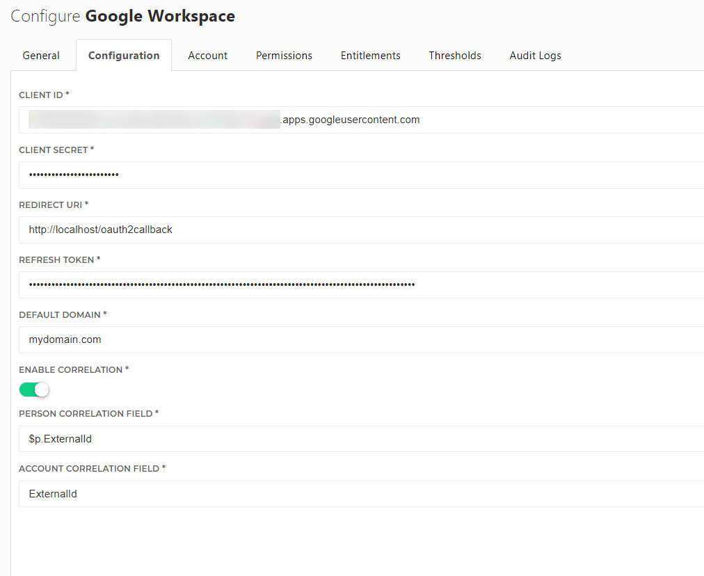

# HelloID-Conn-Prov-Target-Google-Workspace
<p align="center">
  
</p>
In this example we are going to connect to the Google Directory API (https://developers.google.com/admin-sdk/directory) using OAuth2.0 and the Powershell.

<!-- TABLE OF CONTENTS -->
## Table of Contents
* [Getting Started](#getting-started)
* [Setting up the Google API access](#setting-up-the-google-api-access)
* [Getting the authorization code](#getting-the-authorization-code)
* [Getting the refreshtoken](#getting-the-refreshtoken)
* [Setup the PowerShell connector](#setup-the-powerShell-connector)

<!-- GETTING STARTED -->
## Getting Started
By using this connector you will have the ability to create one of the following items in Google GSuite:

* Create user account 
* Enable user account
* Disable user account
* Delete user account
* Manage permissions (grant / revoke)
  * Group Membership
  * Licenses (Statically defined)


## Setting up the Google API access
 1. Go to Google Developers Console and create a new project by clicking on the top bar and choose new project. Give your project a name and click create. When you are done, click the top bar again and select your newly created project.
 2. You will see the empty dashboard where we need to select which API we want to interact with, In this example we are managing user accounts so we selected the Admin SDK. Click Enable after which you will be redirected back to the dashboard.
 3. As stated on the dashboard, go to the credentials menu item and click on + Create Credentials and choose OAuth client ID.
 4. Application type choose Web application.
 5. Fill in a name you like for the OAuth 2.0 client ID.
 6. For Authorized redirect URIs you can specify http://localhost/oauth2callback
 7. Click create the OAuth 2.0 consent screen and we will get the credentials from the credentials page.
 8. The Client ID and Client secret of the new OAuth client we use in the example scripts below.

## Authorization

### Automated Method
1. Run the following PowerShell script as Administrator
2. The script will prompt your for Client ID and Secret
3. The browser will then open and request authorization
4. After confirming authorization, the refresh token will be shown in the browser and console
```
#Input from User
    $ClientID = Read-Host "Please enter your Client ID"
    $ClientSecret = Read-Host "Please enter your Client Secret"

#Obtain Authorization Code
    $redirectUri = "http://localhost/oauth2callback"
    $authUri = "https://accounts.google.com/o/oauth2/auth?client_id=$($ClientID)&scope=https://www.googleapis.com/auth/admin.directory.user https://www.googleapis.com/auth/admin.directory.group https://www.googleapis.com/auth/apps.licensing https://www.googleapis.com/auth/admin.directory.orgunit&response_type=code&redirect_uri=http://localhost/oauth2callback&access_type=offline&approval_prompt=force"

#Listen for Authorization Code Request
$HttpListener = New-Object System.Net.HttpListener
$HttpListener.Prefixes.Add("http://+/oauth2callback/")
$HttpListener.Start()

#Launch Browser to authorize
Start-Process $authUri

While ($HttpListener.IsListening) {
    $HttpContext = $HttpListener.GetContext()
    $HttpRequest = $HttpContext.Request
    $RequestUrl = $HttpRequest.Url.OriginalString
     
    #Authorization Code
    $code = $HttpRequest.QueryString['code'];
    Write-Host "Auth Code: $($code)";

    #Request Refresh Token
    $requestUri = "https://www.googleapis.com/oauth2/v4/token"
    $body = @{
        code=$code;
        client_id=$clientId;
        client_secret=$clientSecret;
        redirect_uri=$redirectUri;
        grant_type="authorization_code"; # Fixed value
    };
    $tokens = Invoke-RestMethod -Uri $requestUri -Method POST -Body $body;
    Write-Host "Refresh Token: $($tokens.refresh_token)"

    #Respond with Refresh Token
    $HttpResponse = $HttpContext.Response
    $HttpResponse.Headers.Add("Content-Type","text/plain")
    $HttpResponse.StatusCode = 200
    $ResponseBuffer = [System.Text.Encoding]::UTF8.GetBytes("Refresh Token: $($tokens.refresh_token)")
    $HttpResponse.ContentLength64 = $ResponseBuffer.Length
    $HttpResponse.OutputStream.Write($ResponseBuffer,0,$ResponseBuffer.Length)
    $HttpResponse.Close()

    #Stop Listener
    $HttpListener.Stop()
 }
```
### Manual Method
#### Getting the authorization code 
With the authorization code, we can get the refresh token. We only need the refresh token. 
1. To get the authorization code please use the URL below and replace the {replaceclientid} with the values from the OAuth client we created before.
```
https://accounts.google.com/o/oauth2/auth?client_id={replaceclientid}&scope=https://www.googleapis.com/auth/admin.directory.user https://www.googleapis.com/auth/admin.directory.group https://www.googleapis.com/auth/apps.licensing https://www.googleapis.com/auth/admin.directory.orgunit&response_type=code&redirect_uri=http://localhost/oauth2callback&access_type=offline&approval_prompt=force
```
2. Open the URL in a webbrowser of your choosing.
3. The browser will be redirected to the redirect URI. We will need to copy the code value out of the URL in the address bar, so we can obtain a refresh token in the next section.
```
Example
http://localhost/oauth2callback?code=4/QhUXhB********************z9jGKkhvac2&
The code would be 4/QhUXhB********************z9jGKkhvac2&
```

#### Getting the refreshtoken
1. To exchange the Authorization code for the refresh token, we will use Powershell to make a call to https://www.googleapis.com/oauth2/v4/token. 
2. Fill in Authorization code, Client Id, Client Secret and Redirect Uri from the Google Developer Console and run the [Authorization.GetRefreshToken.ps1](Scripts/Authorization.GetRefreshToken.ps1) in the repo. It will store the refresh token in a text file so you can use it later on.

Note: The claimed authorization code can be exchanged for a refreshtoken only once, otherwise you have to request a new authorization code as described above.

## Setup the PowerShell connector
1. Add a new 'Target System' to HelloID and make sure to import all the necessary files.

    - [ ] configuration.json
    - [ ] create.ps1
    - [ ] update.ps1
    - [ ] enable.ps1
    - [ ] disable.ps1
    - [ ] delete.ps1
    - [ ] entitlements.ps1
    - [ ] grantPermission.ps1
    - [ ] revokePermission.ps1

2. Fill in the required fields on the 'Configuration' tab. See also, [Setting up the Google API access](#setting-up-the-google-api-access)


* Client ID
* Client Secret
* Redirect URI
* Refresh Token
* Default Domain
* Enable Correlation
  * If enabled, on create HelloID search for a matching existing user, else always create.
* Person Correlation Field
  * Variable to reference for Person Field
* Account Correlation Field
  * Name of the Field to Search


_For more information about our HelloID PowerShell connectors, please refer to our general [Documentation](https://docs.helloid.com/hc/en-us/articles/360012557600-Configure-a-custom-PowerShell-source-system) page_
 
